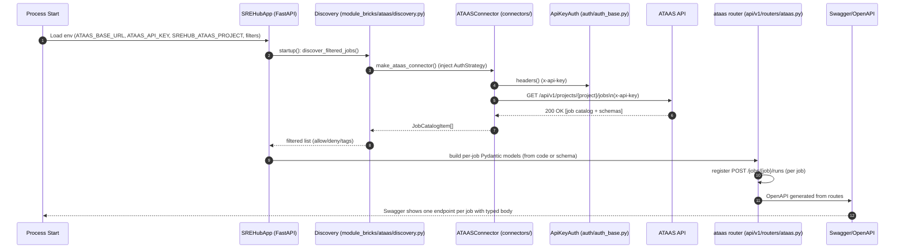
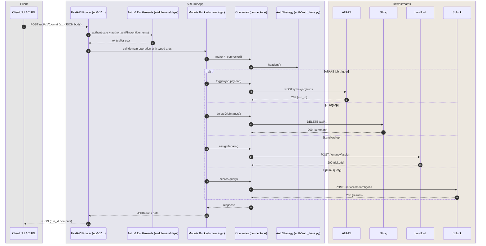

diagrams.

---

## 1. Startup – ATAAS Auto-discovery → Swagger Routes



---

## 2. Runtime – Request Flow (API → Brick → Connector → Downstream)



---

## 3. Error & Retry Path (Connector-level with Circuit Breaker)

```mermaid
sequenceDiagram
    autonumber
    participant BRICK as Module Brick
    participant CONN as Connector
    participant STRAT as AuthStrategy
    participant DS as Downstream Service

    BRICK->>CONN: request(method,path,json)
    CONN->>STRAT: headers()
    loop up to N retries
        CONN->>DS: HTTP request
        alt 5xx/timeout/429
            DS-->>CONN: error
            CONN->>CONN: backoff + maybe open circuit
        else 2xx
            DS-->>CONN: success
            CONN->>CONN: reset failures
            CONN-->>BRICK: return JSON
            break
        end
    end
    alt exhausted retries or circuit open
        CONN-->>BRICK: raise APIError/CircuitOpen
        BRICK-->>BRICK: map to uniform error
    end
```
